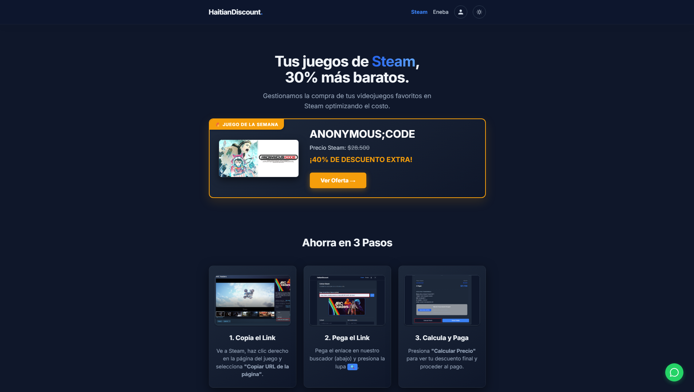

# Hola, soy Ramses Quintanilla

## Sobre mí

Actualmente soy estudiante de la Universidad Catolica del Norte, 
cursando la carrera de Ingenieria Civil en Computacion e Informatica,
Busco especializarme en los Sistemas Inteligentes y el Desarrollo de aplicaciones Web.

#

### Proyecto Destacado

####  [HaitianDiscount](https://github.com/RamOkami/HaitianDiscount)
Una plataforma web estilo *Eneba* desarrollada para un cliente, diseñada para la búsqueda y compra de videojuegos de Steam y Eneba con un margen del 30% de descuento adicional.

  
  

    
    
    
    
  

#

### Mis Habilidades

**Lenguajes de Programación:**

**Frontend y Diseño Web:**

**Herramientas y Bases de Datos:**

#

### Actualmente Aprendiendo

#

### Redes Sociales

